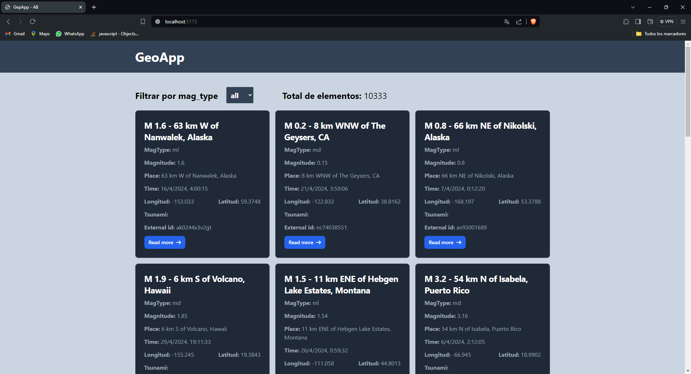
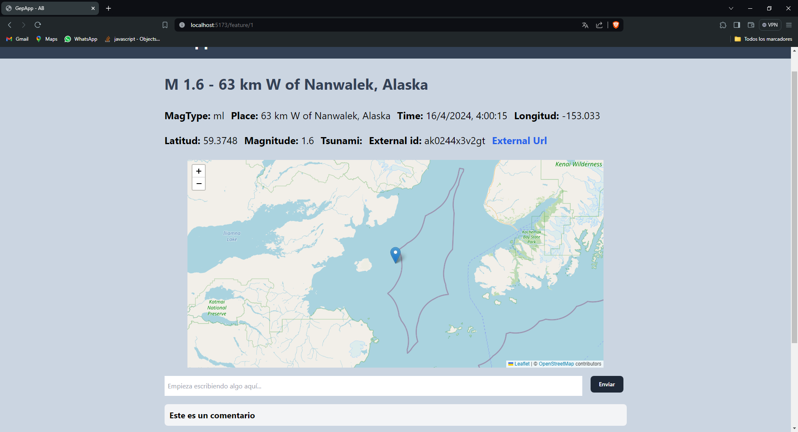

# GeoApp - frontend
## [Ver Backend](https://github.com/DAndersonBurga/GeoApp-backend)




## Configuración
Instalar las dependencias
```shell
  npm install
```
Ejecuta primero el backend y luego:
```shell
  npm run dev
```